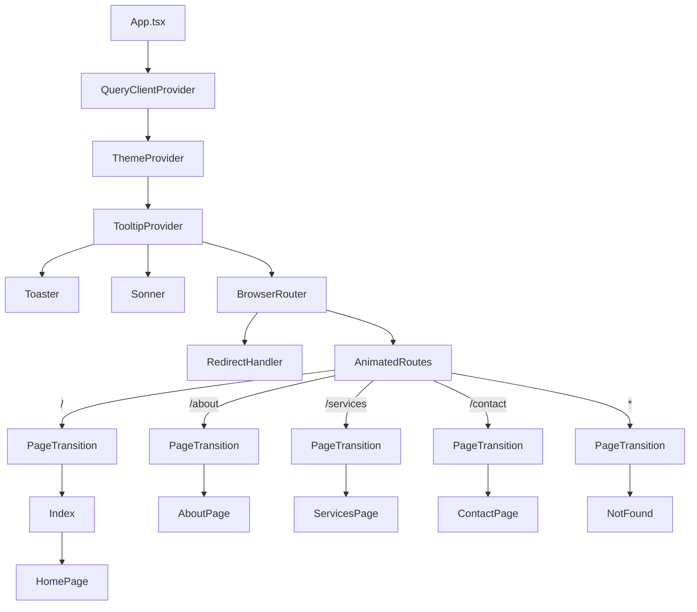
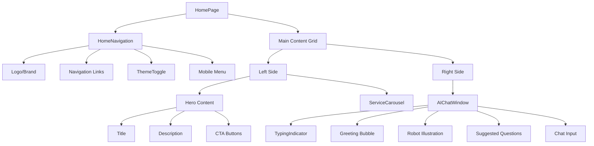
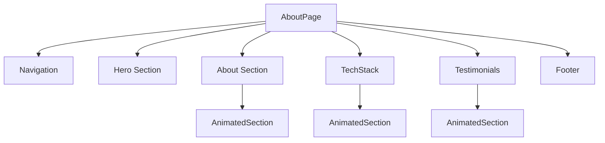
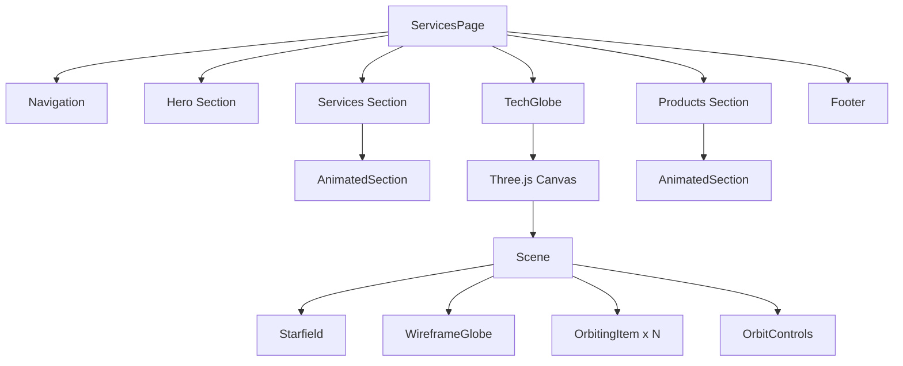
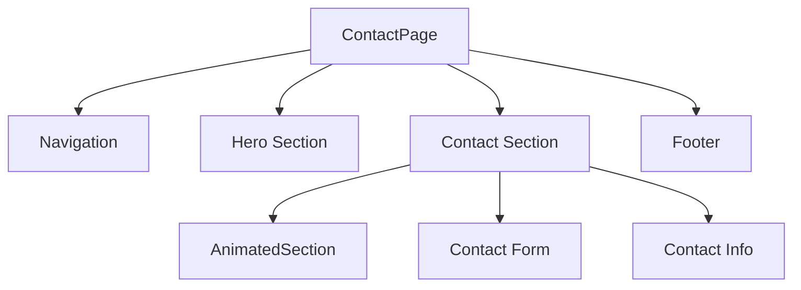

# Component Tree

**Last Updated:** 2026-01-25

---

## Application Component Hierarchy



---

## Page Component Trees

### HomePage (`/`)



### AboutPage (`/about`)



### ServicesPage (`/services`)



### ContactPage (`/contact`)



---

## Component Relationship Matrix

| Component | Uses | Used By |
|-----------|------|---------|
| `App` | Providers, Router | `main.tsx` |
| `ThemeProvider` | React Context | `App` |
| `PageTransition` | Framer Motion | `AnimatedRoutes` |
| `AnimatedSection` | Framer Motion | Page components |
| `Navigation` | NavLink, ThemeToggle | Page components |
| `HomeNavigation` | NavLink, ThemeToggle | `HomePage` |
| `Button` | Radix Slot, CVA | Many components |
| `AIChatWindow` | Button, Input | `HomePage` |
| `TechGlobe` | React Three Fiber | `ServicesPage` |
| `ServiceCarousel` | Card, Carousel | `HomePage` |

---

## Component Categories

### Provider Components

```
QueryClientProvider
└── ThemeProvider
    └── TooltipProvider
```

### Layout Components

```
Navigation
HomeNavigation
Footer
PageTransition
```

### Section Components

```
Hero
About
Services
Products
Contact
TechStack
Testimonials
```

### Interactive Components

```
AIChatWindow
├── TypingIndicator
├── Suggested Questions
└── Chat Input

TechGlobe
├── WireframeGlobe
├── OrbitingItem
├── Starfield
└── OrbitControls
```

### Animation Components

```
PageTransition (route transitions)
AnimatedSection (scroll animations)
```

### UI Components (shadcn/ui)

```
button, input, card, dialog, dropdown-menu,
toast, tooltip, tabs, accordion, sheet,
form, label, select, checkbox, radio-group...
```

---

## Component Depth Analysis

| Level | Components |
|-------|------------|
| 0 | `App` |
| 1 | Providers (`QueryClientProvider`, `ThemeProvider`, etc.) |
| 2 | `BrowserRouter`, `AnimatedRoutes` |
| 3 | `PageTransition` |
| 4 | Page components (`Index`, `AboutPage`, etc.) |
| 5 | Section components (`Hero`, `About`, `Services`, etc.) |
| 6 | Interactive components (`AIChatWindow`, `TechGlobe`) |
| 7 | UI primitives (`Button`, `Input`, etc.) |

---

## Related Documentation

- [Data Flow](./data-flow.md)
- [Routing](./routing.md)
- [Components Overview](../components/README.md)
