# Data Flow

**Last Updated:** 2026-01-25

---

## State Management Overview

The application uses a combination of React's built-in state management and external libraries:


---

## Theme State Flow


### Theme Context Implementation

```tsx
// src/hooks/useTheme.tsx
interface ThemeContextType {
  theme: "light" | "dark";
  setTheme: (theme: Theme) => void;
  toggleTheme: () => void;
  isAutoMode: boolean;
  setIsAutoMode: (auto: boolean) => void;
}
```

### Theme Persistence

| Storage Key | Value | Purpose |
|-------------|-------|---------|
| `theme` | `"light"` \| `"dark"` | User's preferred theme |
| `theme-auto` | `"true"` \| `"false"` | Auto-switch mode status |

### Auto Theme Logic

```tsx
// Time-based theme switching
const getSystemTheme = (): Theme => {
  const hour = new Date().getHours();
  // Dark mode from 6 PM (18:00) to 6 AM (06:00)
  return hour >= 18 || hour < 6 ? "dark" : "light";
};
```

---

## Component State Patterns

### Navigation State


```tsx
// src/components/Navigation.tsx
const [isScrolled, setIsScrolled] = useState(false);
const [isMobileMenuOpen, setIsMobileMenuOpen] = useState(false);
```

### AI Chat Window State


```tsx
// src/components/AIChatWindow.tsx
const [message, setMessage] = useState("");
const [showGreeting, setShowGreeting] = useState(false);
const [showQuestions, setShowQuestions] = useState(false);
const [isTyping, setIsTyping] = useState(true);
const [isSending, setIsSending] = useState(false);
```

---

## React Query (Potential)

The app includes React Query setup but currently uses it minimally:

```tsx
// src/App.tsx
const queryClient = new QueryClient();

<QueryClientProvider client={queryClient}>
  {/* App content */}
</QueryClientProvider>
```

### Future API Integration Pattern


---

## Redirect Handler Flow

```mermaid
sequenceDiagram
    participant User
    participant Browser
    participant SessionStorage
    participant RedirectHandler
    participant Router

    Note over Browser: 404 page stores path
    Browser->>SessionStorage: Store redirect path
    Browser->>Browser: Redirect to /

    Note over RedirectHandler: App loads
    RedirectHandler->>SessionStorage: Check for redirect
    alt Has Redirect
        SessionStorage-->>RedirectHandler: Return stored path
        RedirectHandler->>SessionStorage: Clear redirect
        RedirectHandler->>Router: Navigate to path
    else No Redirect
        RedirectHandler-->>RedirectHandler: Do nothing
    end
```



---

## Animation State Flow

### Page Transitions


```tsx
// Animation variants
const pageVariants = {
  initial: { opacity: 0, x: -20 },
  animate: { opacity: 1, x: 0 },
  exit: { opacity: 0, x: 20 },
};
```

### Scroll Animations


---

## Props Flow Patterns

### Top-Down Props


### Composition Pattern

```tsx
// Parent provides wrapper, children provide content
<PageTransition>
  <Index />
</PageTransition>

<AnimatedSection delay={0.2} direction="up">
  <ServiceCard />
</AnimatedSection>
```

---

## Related Documentation

- [Component Tree](./component-tree.md)
- [Hooks](../api/hooks.md)
- [Theme System](../styling/theme.md)
