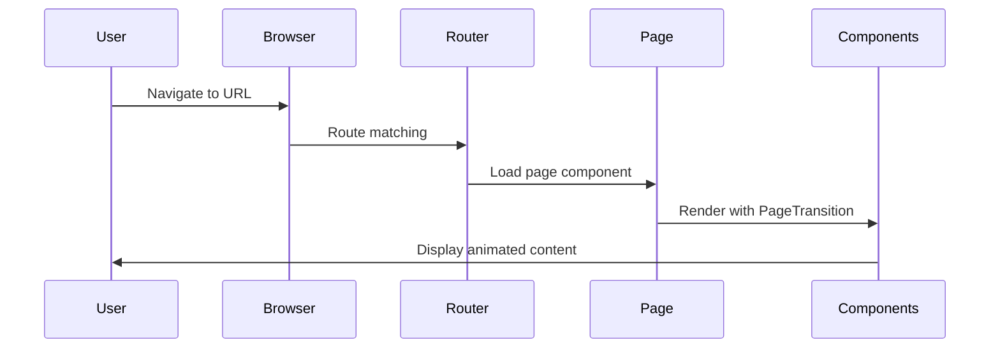
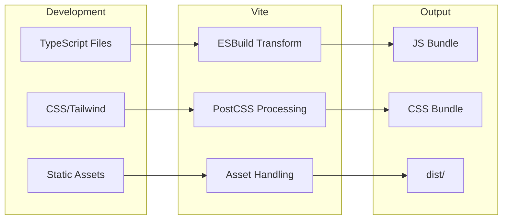

# Architecture Overview

**Last Updated:** 2026-01-25

---

## System Architecture

The Vibe Mind website is a modern single-page application (SPA) built with React and TypeScript, featuring client-side routing, animated transitions, and interactive 3D elements.

```mermaid
graph TD
    subgraph Browser
        HTML[index.html]
        HTML --> ReactApp[React Application]
    end

    subgraph ReactApp
        Main[main.tsx] --> App[App.tsx]
        App --> Providers[Provider Stack]
        Providers --> Router[BrowserRouter]
        Router --> Routes[AnimatedRoutes]
        Routes --> Pages[Page Components]
    end

    subgraph Providers
        QC[QueryClientProvider]
        QC --> TP[ThemeProvider]
        TP --> TTP[TooltipProvider]
        TTP --> Toasters[Toaster + Sonner]
    end

    subgraph Pages
        Index[Index]
        About[AboutPage]
        Services[ServicesPage]
        Contact[ContactPage]
        NotFound[NotFound]
    end
```

---

## Technology Stack

### Core Framework

| Technology | Version | Purpose |
|------------|---------|---------|
| React | 18.3.1 | UI library |
| TypeScript | 5.8.3 | Type safety |
| Vite | 5.4.19 | Build tool & dev server |

### Styling

| Technology | Version | Purpose |
|------------|---------|---------|
| Tailwind CSS | 3.4.17 | Utility-first CSS |
| tailwindcss-animate | 1.0.7 | Animation utilities |
| class-variance-authority | 0.7.1 | Component variants |
| tailwind-merge | 2.6.0 | Class merging |
| clsx | 2.1.1 | Conditional classes |

### UI Components

| Technology | Version | Purpose |
|------------|---------|---------|
| shadcn/ui | - | Component library |
| Radix UI | Various | Accessible primitives |
| Lucide React | 0.462.0 | Icon library |

### Animation

| Technology | Version | Purpose |
|------------|---------|---------|
| Framer Motion | 12.29.0 | Page transitions & animations |

### 3D Graphics

| Technology | Version | Purpose |
|------------|---------|---------|
| Three.js | 0.160.0 | 3D rendering engine |
| React Three Fiber | 8.15.0 | React renderer for Three.js |
| React Three Drei | 9.92.0 | Three.js helpers |

### Routing & State

| Technology | Version | Purpose |
|------------|---------|---------|
| React Router DOM | 6.30.1 | Client-side routing |
| TanStack React Query | 5.83.0 | Server state management |

### Forms & Validation

| Technology | Version | Purpose |
|------------|---------|---------|
| React Hook Form | 7.61.1 | Form handling |
| Zod | 3.25.76 | Schema validation |
| @hookform/resolvers | 3.10.0 | Zod integration |

---

## Application Flow



---

## Provider Stack

The application wraps all content in a provider hierarchy:

```tsx
// src/App.tsx
<QueryClientProvider client={queryClient}>
  <ThemeProvider>
    <TooltipProvider>
      <Toaster />
      <Sonner />
      <BrowserRouter>
        <RedirectHandler />
        <AnimatedRoutes />
      </BrowserRouter>
    </TooltipProvider>
  </ThemeProvider>
</QueryClientProvider>
```

### Provider Responsibilities

1. **QueryClientProvider** - Manages server state caching with React Query
2. **ThemeProvider** - Handles dark/light theme state and persistence
3. **TooltipProvider** - Enables tooltip functionality across the app
4. **Toaster/Sonner** - Toast notification systems
5. **BrowserRouter** - Enables client-side routing

---

## Key Design Patterns

### 1. Component Composition

Components are designed for composition rather than configuration:

```tsx
<PageTransition>
  <Index />
</PageTransition>
```

### 2. Context for Global State

Theme state is managed via React Context:

```tsx
const { theme, toggleTheme } = useTheme();
```

### 3. Path Aliases

Clean imports using `@/` alias:

```tsx
import { Button } from "@/components/ui/button";
```

### 4. CSS Variables for Theming

Colors defined as HSL CSS variables:

```css
--primary: 205 90% 58%;
--background: 0 0% 100%;
```

### 5. Responsive Design

Mobile-first with Tailwind breakpoints:

```tsx
className="text-sm md:text-base lg:text-lg"
```

---

## Build Architecture



---

## Related Documentation

- [Folder Structure](./folder-structure.md)
- [Component Tree](./component-tree.md)
- [Data Flow](./data-flow.md)
- [Routing](./routing.md)
