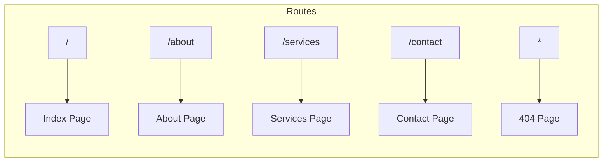

# Routing

**Last Updated:** 2026-01-25

---

## Route Structure



---

## Route Configuration

Routes are defined in `src/App.tsx`:

```tsx
const AnimatedRoutes = () => {
  const location = useLocation();

  return (
    <AnimatePresence mode="wait">
      <Routes location={location} key={location.pathname}>
        <Route path="/" element={<PageTransition><Index /></PageTransition>} />
        <Route path="/about" element={<PageTransition><AboutPage /></PageTransition>} />
        <Route path="/services" element={<PageTransition><ServicesPage /></PageTransition>} />
        <Route path="/contact" element={<PageTransition><ContactPage /></PageTransition>} />
        <Route path="*" element={<PageTransition><NotFound /></PageTransition>} />
      </Routes>
    </AnimatePresence>
  );
};
```

---

## Route Table

| Path | Component | Description |
|------|-----------|-------------|
| `/` | `Index` | Home page with AI chat window |
| `/about` | `AboutPage` | Company information |
| `/services` | `ServicesPage` | Services and tech stack |
| `/contact` | `ContactPage` | Contact form and info |
| `*` | `NotFound` | 404 error page |

---

## Page Components

### Index (`/`)

**File:** `src/pages/Index.tsx`

```tsx
import HomePage from "@/components/HomePage";

const Index = () => {
  return <HomePage />;
};
```

Renders the main home page with:
- `HomeNavigation` - Simplified navigation
- Hero content with CTA buttons
- `ServiceCarousel` - Service previews
- `AIChatWindow` - AI assistant interface

### AboutPage (`/about`)

**File:** `src/pages/AboutPage.tsx`

Includes:
- `Navigation` - Full navigation bar
- `Hero` - Hero section
- `About` - About content
- `TechStack` - Technology showcase
- `Testimonials` - Client testimonials
- `Footer` - Site footer

### ServicesPage (`/services`)

**File:** `src/pages/ServicesPage.tsx`

Includes:
- `Navigation` - Full navigation bar
- `Hero` - Hero section
- `Services` - Service details
- `TechGlobe` - 3D tech visualization
- `Products` - Product showcase
- `Footer` - Site footer

### ContactPage (`/contact`)

**File:** `src/pages/ContactPage.tsx`

Includes:
- `Navigation` - Full navigation bar
- `Hero` - Hero section
- `Contact` - Contact form and information
- `Footer` - Site footer

### NotFound (`*`)

**File:** `src/pages/NotFound.tsx`

404 error page with navigation back to home.

---

## Navigation Components

### Main Navigation (`Navigation`)

Used on About, Services, and Contact pages:

```tsx
const navItems = [
  { label: "About", href: "#about" },
  { label: "Services", href: "#services" },
  { label: "Products", href: "#products" },
  { label: "Tech Stack", href: "#tech-stack" },
  { label: "Contact", href: "#contact" }
];
```

Features:
- Scroll-based background change
- Mobile hamburger menu
- Smooth scroll to sections
- Keyboard (Escape) to close menu

### Home Navigation (`HomeNavigation`)

Used only on the Index page:

- Simplified for homepage layout
- Links to other pages rather than sections
- Includes theme toggle

---

## Page Transitions

All routes are wrapped with `PageTransition`:

```tsx
<Route
  path="/about"
  element={
    <PageTransition>
      <AboutPage />
    </PageTransition>
  }
/>
```

### Transition Animation

```tsx
const pageVariants = {
  initial: { opacity: 0, x: -20 },
  animate: { opacity: 1, x: 0 },
  exit: { opacity: 0, x: 20 },
};

const pageTransition = {
  type: "tween",
  ease: "anticipate",
  duration: 0.4,
};
```

---

## Redirect Handling

The app includes a redirect handler for SPA 404 handling:

```tsx
const RedirectHandler = () => {
  const navigate = useNavigate();

  useEffect(() => {
    const redirect = sessionStorage.getItem('redirect');
    if (redirect) {
      sessionStorage.removeItem('redirect');
      navigate(redirect || '/');
    }
  }, [navigate]);

  return null;
};
```

This works with static hosts that don't support SPA routing by:
1. Storing the attempted path in session storage (on 404)
2. Redirecting to index
3. Reading the stored path and navigating

---

## In-Page Navigation

### Anchor Links

Sections within pages use anchor links with smooth scroll:

```tsx
onClick={(e) => {
  e.preventDefault();
  const element = document.querySelector(item.href);
  if (element) {
    element.scrollIntoView({ behavior: 'smooth' });
  }
}}
```

### Section IDs

| Section | ID |
|---------|-----|
| About | `#about` |
| Services | `#services` |
| Products | `#products` |
| Tech Stack | `#tech-stack` |
| Contact | `#contact` |

---

## Adding New Routes

To add a new route:

1. Create the page component in `src/pages/`:
   ```tsx
   // src/pages/NewPage.tsx
   const NewPage = () => {
     return <div>New Page Content</div>;
   };
   export default NewPage;
   ```

2. Add the route in `src/App.tsx`:
   ```tsx
   import NewPage from "./pages/NewPage";

   // In AnimatedRoutes:
   <Route
     path="/new"
     element={
       <PageTransition>
         <NewPage />
       </PageTransition>
     }
   />
   ```

3. Add navigation link if needed:
   ```tsx
   // In Navigation.tsx or HomeNavigation.tsx
   { label: "New", href: "/new" }
   ```

---

## Related Documentation

- [Component Tree](./component-tree.md)
- [Page Components](../components/pages.md)
- [Animations](../components/animations.md)
