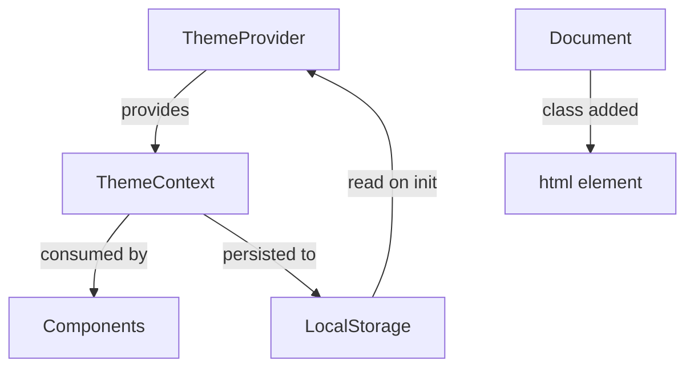

# Theme System

**Last Updated:** 2026-01-25

---

## Overview

The application supports light and dark themes with optional automatic switching based on time of day.

---

## Architecture



---

## ThemeProvider

**File:** `src/hooks/useTheme.tsx`

The `ThemeProvider` component wraps the application and provides theme context.

### Setup

```tsx
// src/App.tsx
import { ThemeProvider } from "@/hooks/useTheme";

const App = () => (
  <ThemeProvider>
    {/* Application content */}
  </ThemeProvider>
);
```

### Context Value

```tsx
interface ThemeContextType {
  theme: "light" | "dark";
  setTheme: (theme: Theme) => void;
  toggleTheme: () => void;
  isAutoMode: boolean;
  setIsAutoMode: (auto: boolean) => void;
}
```

---

## Using the Theme

### useTheme Hook

```tsx
import { useTheme } from "@/hooks/useTheme";

const Component = () => {
  const { theme, toggleTheme, isAutoMode, setIsAutoMode } = useTheme();

  return (
    <button onClick={toggleTheme}>
      Current: {theme}
    </button>
  );
};
```

### Theme-aware Styling

```tsx
// Using CSS variables (automatic)
<div className="bg-background text-foreground">

// Conditional rendering
const { theme } = useTheme();


// Dark mode variants
<div className="bg-white dark:bg-slate-900">
```

---

## Auto Mode

When auto mode is enabled, the theme automatically switches based on time:

| Time | Theme |
|------|-------|
| 6:00 AM - 5:59 PM | Light |
| 6:00 PM - 5:59 AM | Dark |

### Implementation

```tsx
const getSystemTheme = (): Theme => {
  const hour = new Date().getHours();
  return hour >= 18 || hour < 6 ? "dark" : "light";
};

// Check every minute
useEffect(() => {
  if (!isAutoMode) return;

  const checkAndUpdateTheme = () => {
    const newTheme = getSystemTheme();
    setThemeState(newTheme);
  };

  const interval = setInterval(checkAndUpdateTheme, 60000);
  checkAndUpdateTheme();

  return () => clearInterval(interval);
}, [isAutoMode]);
```

### User Controls

```tsx
// Disable auto mode (manual control)
const { toggleTheme, setIsAutoMode } = useTheme();

const handleManualToggle = () => {
  setIsAutoMode(false);  // Disable auto
  toggleTheme();          // Switch theme
};

// Enable auto mode
const enableAuto = () => setIsAutoMode(true);
```

---

## Persistence

Theme preferences are stored in `localStorage`:

| Key | Values | Purpose |
|-----|--------|---------|
| `theme` | `"light"` \| `"dark"` | User's theme preference |
| `theme-auto` | `"true"` \| `"false"` | Auto mode enabled |

### Initial Load

```tsx
const [theme, setThemeState] = useState<Theme>(() => {
  const stored = localStorage.getItem("theme");
  const isAuto = localStorage.getItem("theme-auto") !== "false";

  if (isAuto) {
    return getSystemTheme();
  }
  return (stored as Theme) || getSystemTheme();
});
```

---

## CSS Variables

### Light Theme (Default)

```css
:root {
  --background: 0 0% 100%;
  --foreground: 240 10% 3.9%;
  --card: 0 0% 100%;
  --card-foreground: 240 10% 3.9%;
  --primary: 205 90% 58%;
  --primary-foreground: 0 0% 100%;
  --secondary: 240 4.8% 95.9%;
  --muted: 240 4.8% 95.9%;
  --muted-foreground: 240 3.8% 46.1%;
  --accent: 185 95% 58%;
  --border: 240 5.9% 90%;
  /* ... */
}
```

### Dark Theme

```css
.dark {
  --background: 240 50% 6%;
  --foreground: 0 0% 98%;
  --card: 240 50% 10%;
  --card-foreground: 0 0% 98%;
  --primary: 205 85% 60%;
  --primary-foreground: 0 0% 100%;
  --secondary: 240 50% 12%;
  --muted: 240 50% 12%;
  --muted-foreground: 240 5% 64.9%;
  --accent: 185 90% 60%;
  --border: 240 40% 18%;
  /* ... */
}
```

---

## Tailwind Configuration

```tsx
// tailwind.config.ts
export default {
  darkMode: ["class"],  // Class-based dark mode
  // ...
}
```

This enables the `.dark` class on `<html>` to trigger dark mode styles.

---

## Applying Theme

```tsx
// In ThemeProvider
useEffect(() => {
  const root = document.documentElement;
  root.classList.remove("light", "dark");
  root.classList.add(theme);
}, [theme]);
```

The theme class is applied to `<html>` element, enabling CSS variable overrides.

---

## Theme-specific Styles

### Gradients

```css
/* Light mode */
:root {
  --gradient-primary: linear-gradient(135deg, hsl(240 70% 20%), hsl(255 75% 55%), hsl(205 90% 58%));
  --shadow-glow: 0 0 50px hsl(200 95% 65% / 0.4);
}

/* Dark mode */
.dark {
  --gradient-primary: linear-gradient(135deg, hsl(240 50% 12%), hsl(255 70% 50%), hsl(205 85% 60%));
  --shadow-glow: 0 0 60px hsl(200 90% 70% / 0.5);
}
```

### Shadows

```css
/* Light mode */
:root {
  --shadow-elegant: 0 20px 40px -15px hsl(240 70% 20% / 0.3);
}

/* Dark mode */
.dark {
  --shadow-elegant: 0 25px 50px -12px hsl(0 0% 0% / 0.6);
}
```

---

## Adding New Theme Variables

1. Add CSS variable in `src/index.css`:

```css
:root {
  --new-color: 200 50% 50%;
}

.dark {
  --new-color: 200 60% 40%;
}
```

2. Add to Tailwind config:

```tsx
// tailwind.config.ts
colors: {
  "new-color": "hsl(var(--new-color))",
}
```

3. Use in components:

```tsx
<div className="bg-new-color text-new-color-foreground">
```

---

## Related Documentation

- [Design System](./design-system.md)
- [Hooks](../api/hooks.md)
- [Tailwind Config](./tailwind-config.md)
